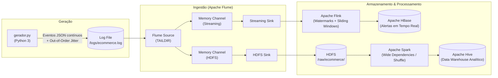

# Trabalho Prático (T.P) • AP1 — Arquitetura de Big Data em Tempo Real
### Monitoramento de Vendas e Logística de um E-commerce

---

## 👥 Identificação da Equipe (Grupo 3)

| Integrante | Função / Frente Principal |
| :--- | :--- |
| **Kelvin Barros Dias** | Arquitetura, Docker & Ingestão com Flume |
| **Micaell Gomes** | Geração de Dados Contínuos & Roteiro do Vídeo |
| **Ester Luiza De Souza Lima** | Streaming com Flink (Watermarks e Janelas Deslizantes) |
| **Kaike Ferreira Alves** | Streaming com Flink & Persistência em HBase |
| **Julio Henrique Rodrigues Fernandes** | Batch Analytics com Spark (Wide Dependencies) & Hive |

---

## 🏗️ 1. Visão Geral da Arquitetura

O projeto implementa uma arquitetura híbrida de Big Data cobrindo o ciclo de vida completo do dado: **Geração de Dados → Ingestão → Streaming de Baixa Latência → Batch Analytics → Armazenamento Especializado**.



---

## 🛠️ 2. Stack Tecnológica e Papel de Cada Componente

1. **Python 3 (`generator/gerador.py`)**:
   - Gera continuamente eventos sintéticos em JSON: `CLICK`, `CART_ADD`, `CART_REMOVE`, `CHECKOUT_COMPLETED` e `DELIVERY_UPDATE`.
   - Incorpora injeção de **eventos fora de ordem** (`is_simulated_late = True`) com atraso de até 20 segundos para validação do Watermark.
2. **Apache Flume (`flume/flume.conf`)**:
   - Fonte `TAILDIR` com controle transacional de ponteiro em arquivo JSON.
   - Canais de memória com replicação (*fan-out*) direcionando os dados simultaneamente para o HDFS e para o Flink.
3. **Apache Flink (`flink/flink_streaming_job.py`)**:
   - Janelas deslizantes baseadas em **Event Time** (janela de 60s, slide de 15s).
   - Gerenciamento de eventos atrasados com **Watermark** (`BoundedOutOfOrderness`).
   - Disparo de alertas imediatos de atrasos críticos e picos de demanda (*Trending Products*).
4. **Apache Spark (`spark/etl_batch.py`)**:
   - Processamento em lote sobre o histórico de arquivos brutos no HDFS.
   - Aplicação explícita de **Wide Dependencies** (`reduceByKey`, `join` e `groupBy`) gerando fases de *Shuffle* comprovadas no Spark UI.
   - Cálculo de métricas consolidadas de funil de conversão e SLA de entregas.
5. **Camada de Armazenamento Especializada**:
   - **HDFS**: Repositório imutável para os logs brutos particionados por ano/mês/dia.
   - **Apache HBase**: Tabela NoSQL orientada a colunas para consultas operacionais randômicas de baixíssima latência dos alertas gerados pelo Flink.
   - **Apache Hive**: Data Warehouse com tabelas ORC particionadas para consultas analíticas e relatórios de BI.

---

## 📂 3. Estrutura do Repositório

```text
Trabalho BIG DATA/
├── docker/
│   ├── docker-compose.yml       # Cluster Hadoop, HBase, Hive, Flink, Spark e Flume
│   └── hadoop.env               # Variáveis de ambiente e limites de memória JVM
├── generator/
│   ├── gerador.py               # Gerador contínuo de eventos JSON (Python 3)
│   └── run_generator.sh         # Script de execução rápida do gerador
├── flume/
│   ├── flume.conf               # Configuração do agente Flume (TAILDIR -> HDFS + Flink)
│   └── flume-env.sh             # Ajustes de memória para o Flume
├── flink/
│   ├── flink_streaming_job.py   # Job Flink com Janelas Deslizantes, Watermarks e HBase Sink
│   └── requirements.txt         # Dependências do streaming
├── spark/
│   └── etl_batch.py             # Job Spark com Wide Dependencies e carga no Hive
├── storage/
│   ├── hdfs_init.sh             # Script de criação da estrutura de pastas no HDFS
│   ├── hbase_schema.hbase       # DDL das tabelas no HBase
│   └── hive_tables.sql          # DDL do Data Warehouse no Hive
├── docs/
│   ├── roteiro_video_5min.md    # Roteiro minuto a minuto para o vídeo de apresentação
│   └── justificativas_tecnicas.md # Defesa dos trade-offs técnicos (30% da avaliação)
├── logs/                        # Diretório local onde os logs são escritos e monitorados
└── README.md                    # Este arquivo
```

---

## 🚀 4. Guia de Execução Passo a Passo

### Pré-requisitos
- Sistema operacional macOS / Linux com **Docker Desktop** ativo.
- Python 3.9+ instalado.
- Mínimo de 8GB de RAM livre para os containers Docker.

---

### Passo 1: Iniciar o Ambiente Docker
Com o Docker Desktop aberto, suba os serviços a partir da raiz do projeto:
```bash
cd docker
docker compose up -d
```
Verifique se todos os containers subiram:
```bash
docker compose ps
```

Interfaces Web disponíveis:
- **HDFS NameNode**: [http://localhost:9870](http://localhost:9870)
- **HBase Master**: [http://localhost:16010](http://localhost:16010)
- **Flink Dashboard**: [http://localhost:8081](http://localhost:8081)
- **Spark Master**: [http://localhost:8080](http://localhost:8080)

---

### Passo 2: Inicializar os Schemas de Armazenamento
Execute os scripts de preparação do HDFS e HBase:
```bash
# Criar diretórios no HDFS
docker exec -it namenode bash /storage/hdfs_init.sh

# Criar tabelas no HBase
docker exec -it hbase hbase shell /storage/hbase_schema.hbase
```

---

### Passo 3: Iniciar o Gerador de Eventos
Em um terminal dedicado, execute o gerador:
```bash
./generator/run_generator.sh 5 0.15
```

---

### Passo 4: Executar o Job Streaming do Flink
Em outro terminal, inicie o consumo em streaming:
```bash
python3 flink/flink_streaming_job.py logs/ecommerce.log
```

---

### Passo 5: Executar o Job Batch do Spark
Após coletar logs brutos, execute o job analítico:
```bash
python3 spark/etl_batch.py
```

---

## ⚖️ 5. Justificativas Técnicas (30% da Nota da Apresentação)

As decisões de arquitetura estão documentadas em [docs/justificativas_tecnicas.md](docs/justificativas_tecnicas.md):
- **Por que Flink e não Spark Streaming?** Flink é nativamente *event-driven* com latência em milissegundos e suporte a Watermarks e Janelas Deslizantes, enquanto Spark Streaming tradicional opera por micro-batching.
- **Por que HBase e não apenas HDFS?** HDFS é *write-once, read-many*. O HBase provê leitura e escrita randômica por chave (`RowKey`) em milissegundos para atendimento operacional.
- **Por que Hive e não HDFS direto?** O Hive provê catálogo semântico (Metastore), particionamento para economia de I/O (*Partition Pruning*) e suporte a ferramentas de BI.

---

## 📹 6. Apresentação em Vídeo (Máximo 5 Minutos)

Roteiro cronometrado e dividido entre os 5 integrantes: [docs/roteiro_video_5min.md](docs/roteiro_video_5min.md).
